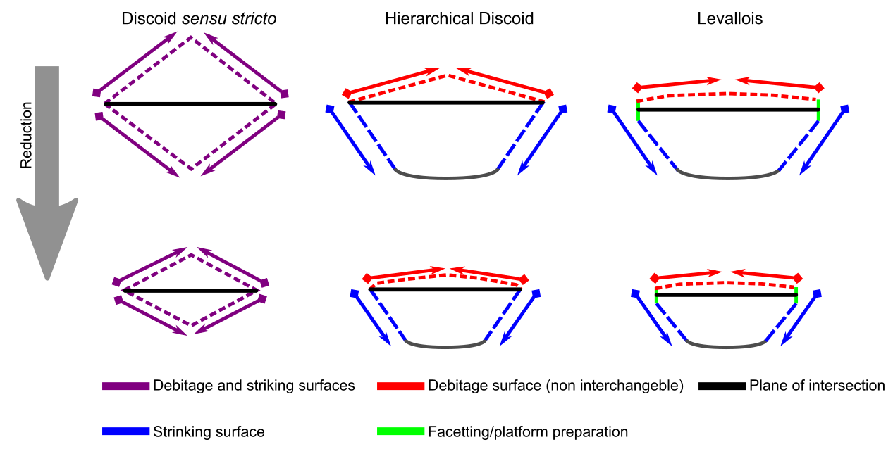
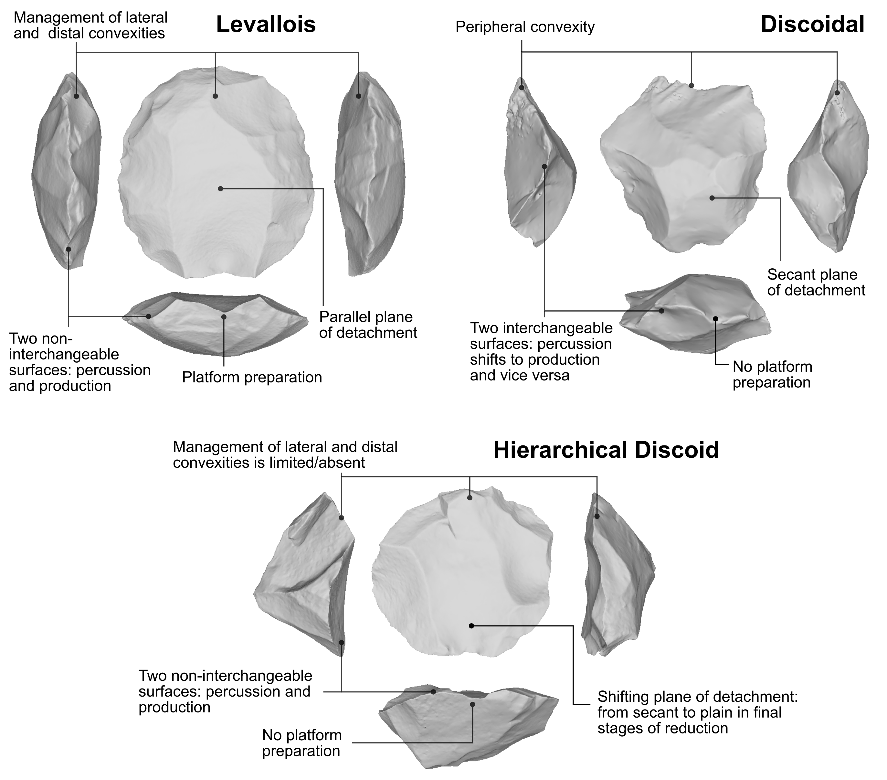
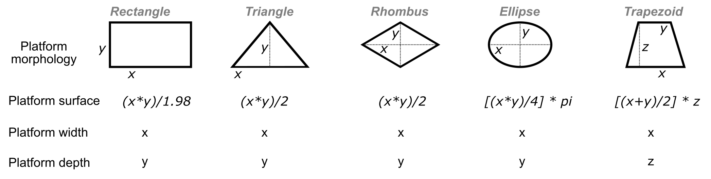
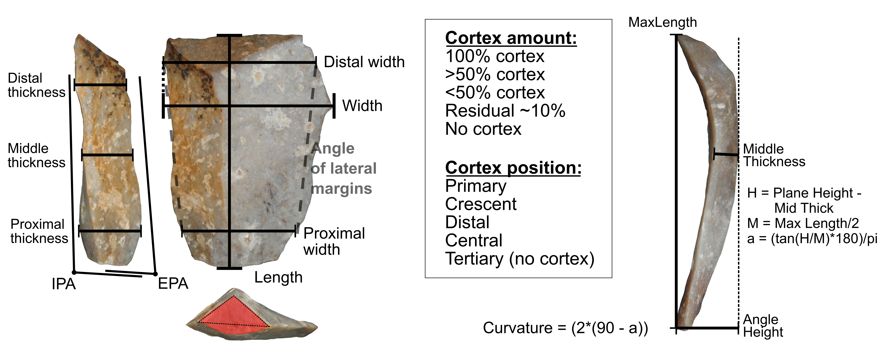

```{r setup, include=FALSE}
knitr::opts_chunk$set(echo = TRUE)
```


Guillermo Bustos-Pérez $^{1,2,3}$, Javier Baena $^{1}$, Manuel Vaquero $^{2,3}$   

$^1$ Universidad Autónoma de Madrid. Departamento de Prehistoria y Arqueología, Campus de Cantoblanco, 28049 Madrid, Spain    
$^2$ Institut Català de Paleoecologia Humana i Evolució Social (IPHES), Zona Educacional 4, Campus Sescelades URV (Edifici W3), 43007 Tarragona, Spain   
$^3$ Universitat Rovira i Virgili, Departament d’Història i Història de l’Art, Avinguda de Catalunya 35, 43002 Tarragona, Spain       

<div align="justify">   
**Abstract**   
Lithic artefacts are usually associated with the different knapping methods used in their production. Flakes exhibit metric and technological features representative of the flaking method used to detach them. However, lithic production is a dynamic process in which discrete methods can be blurred, and in which features can vary throughout the process. An intermediate knapping method between the discoid and Levallois is commonly referred to under an umbrella of terms (the present research uses the term hierarchical discoid), and is associated with a broad geographical and chronological distribution throughout the Early and Middle Palaeolithic. This intermediate knapping strategy exhibits features of both the discoid and Levallois knapping methods, raising the question of the extent to which flakes from the three knapping methods can be differentiated and, when one is mistaken for another, the direction of confusion. An experimental assemblage of flakes detached by means of the three methods was used along with an attribute analysis and machine learning models in an effort to identify the knapping methods employed. In general, our results were able to very effectively differentiate between the three knapping methods when a support vector machine with polynomial kernel was used. Our results also underscored the singularity of flakes detached by means of Levallois reduction sequences, which yielded outstanding identification values, and were rarely erroneously attributed to either of the other two knapping methods studied. Mistaking the products of the discoid and hierarchical discoid methods was the most common direction of confusion, although a good identification value was achieved for discoid flakes and an acceptable value for hierarchical discoid flakes. This shows the potential applicability of machine learning models in combination with attribute analysis for the identification of these knapping methods among flakes.      
  
**Keywords:** lithic technology; experimental archaeology; Levallois; discoid; Middle Palaeolithic; machine learning         

**Extended abstract**   
La producción de lascas se asocia a diferentes métodos de talla. Las lascas resultantes presentan características métricas y atributos que son representativos del método de talla del que se han producido. Sin embargo, la talla lítica es un proceso dinámico en el que los métodos de talla definidos pueden verse entremezclados debido a adaptaciones a las características volumétricas y de calidad de la materia prima, diferentes fases a lo largo del proceso de reducción, aspectos cronoculturales, etc. Esto da lugar a que las características de los productos de talla varíen a lo largo del proceso de reducción. Bajo diferentes términos es común encontrar alusiones a un método de talla intermedio entre el discoide y el Levallois, presentando una amplia distribución geográfica y cronológica a lo largo del Paleolítico Medio y el Paleolítico Medio inicial. La concepción de este método de talla, referido en el presente documento como Discoide Jerárquico, posee características intermedias entre el Levallois (jerarquización de superficies no intercambiables o un plano de talla paralelo a la intersección de ambas superficies) y el discoide (ausencia de preparación de talones, planos de talla secantes en la fase inicial de talla), surgiendo la duda de hasta qué se pueden diferenciar los productos de lascado de los tres métodos y sobre la direccionalidad de las confusiones.    

El presente trabajo emplea un conjunto experimental de lascas procedentes de los tres métodos de talla (77 del método de talla discoide, 73 del Levallois y 72 del Discoide Jerárquico). Sobre este conjunto experimental de lascas se realiza un análisis métrico y de atributos, y sobre los datos procedentes de este análisis se entrenan diez algoritmos de aprendizaje automático con el objetivo de determinar hasta qué punto es posible diferenciar el método de talla. Para evaluar los algoritmos de aprendizaje automático se tiene en cuenta la precisión general de los modelos, pero también los efectos del uso de umbrales de probabilidad en la identificación de los métodos de talla. El uso de umbrales de probabilidad permite optimizar el ratio de positivos verdaderos y positivos falsos para cada umbral de decisión y de ahí extraer el “área bajo la curva” (AUC en inglés) como valor de avaluación de un modelo.   

De los diez algoritmos de aprendizaje automático, una máquina de vector soporte con kernel polinomial presenta los mejores resultados en la identificación de los tres métodos de talla, proporcionando unos resultados excelentes a la hora de diferenciar entre los tres métodos a nivel general (0.667 precisión, 0.824 AUC). Considerando individualmente cada método de talla, los resultados subrayan el carácter singular de las lascas procedentes de secuencias de reducción Levallois ya que obtienen una identificación excepcionalmente buena (AUC de 0.91), siendo su procedencia raramente atribuida a cualquiera de los otros dos métodos. La confusión entre productos procedentes de secuencias de talla discoide y el Discoide Jerárquico es más común, aunque se alcanza una identificación excelente en el caso de los productos procedentes de reducciones discoides (AUC de 0.82) y una identificación aceptable en el caso los productos procedentes del Discoide Jerárquico (AUC de 0.73).    

Estos resultados muestran el potencial de combinar modelos de aprendizaje automático con análisis de atributos sobre lascas para la identificación de métodos de talla. Su uso puede servir de gran ayuda en la identificación de métodos de talla en lascas. Sin embargo, su uso requiere de una evaluación previa de los conjuntos líticos para determinar posibles métodos de talla existentes, uso diferencial de las materias primas, y evaluación de las cadenas operativas presentes. 

**Palabras clave**: tecnología lítica; arqueología experimental; Levallois; Discoid; Paleolítico Medio; Aprendizaje Automático     


## 1. Introduction  

The Middle Palaeolithic in western Europe is characterised by the increase in and diversification of prepared core knapping methods, resulting in flake-dominated assemblages [@kuhn_roots_2013]. These flake-dominated assemblages are the result of a wide number of production methods including Levallois [@boeda_concept_1994; @dibble_levallois:_1995; @boeda_identification_1990], discoid [@boeda_debitage_1993; @boeda_caracteristiques_1995], the *système par surface de débitage alterné* or SSDA [@forestier_clactonien:_1993; @ohel_clactonian_1979], Quina [@bourguignon_conception_1996; @bourguignon_mousterien_1997], different laminar production systems [@farizy_surface_1990; @revillon_les_1994], and the Kombewa [@newcomer_nucleus_1974; @tixier_kombewa_1999] among several others. This abundance of different production methods results in a highly diversified material culture in which flakes exhibit great morphological variability. Flakes often retain morphologies and attributes characteristic of the knapping method used to detach them, facilitating the identification of those methods. However, flakes also often present overlapping attributes and morphologies as a result of the high internal variability of the methods used and the fact that flakes with similar functional properties can be produced via different methods [@hovers_diversity_2006, @kuhn_roots_2013]. Due to their extensive geographical and chronological distribution, the Levallois and discoid constitute important sources of cultural variability in the Middle Palaeolithic of western Europe.      
  
Boëda [-@boeda_concept_1994; -@dibble_levallois:_1995] establishes six characteristics defining the Levallois knapping strategy from a technological point of view:

  1) The volume of the core is conceived in two convex asymmetric surfaces.  
  2) These two surfaces are hierarchical and are not interchangeable. They maintain their role of striking and debitage (or exploitation) surface respectively along the whole reduction process.  
  3) The distal and lateral convexities of the debitage surface are maintained to  obtain predetermined flakes.   
  4) The plane of fracture of the predetermined products is parallel to the intersection between both surfaces.  
  5) The striking platform is perpendicular to the overhang (the core edge, at the intersection between the two core surfaces).  
  6) The technique employed during the knapping process is the direct percussion with hard hammer.   

Depending on the organization of the debitage surface Levallois cores are usually classified into preferential method (were a single predetermined Levallois flake is obtained from the debitage surface) or recurrent methods (were several predetermined flakes are produced from the debitage surface) with removals being either unidirectional, bidirectional or centripetal [@dibble_levallois:_1995; @boeda_identification_1990; @dibble_variability_1995; @hovers_diversity_2006].  
  
Because of its early recognition in the XIX century [@boucher_de_perthes_antiquites_1857], its association with cognitive abilities of planning and predetermination [@boeda_concept_1994; @pelegrin_cognition_2009], and its use for the definition of cultural facies [@bordes_mousterian_1961; @bordes_typologie_1961] and lithic technocomplexes [@vandermeersch_les_2007; @faivre_late_2017], the Levallois flaking technology is considered a trademark of the Middle Paleolithic. Emergence of the Levallois method is observed from MIS12 to MIS9, with several sites presenting elements characteristic of Levallois production[@carmignani_technological_2017; @herisson_emergence_2016; @moncel_early_2020; @soriano_early_2017; @white_lower_2003]. However, Levallois is clearly generalized and identified from MIS8 onwards, covering a wide geographical distribution throughout Western Europe [@vandermeersch_les_2007; @hovers_diversity_2006; @faivre_late_2017; @geneste_developpement_1990]. The long geographical and temporary span of Levallois adds additional layers of variability which can result from raw material constraints, synchronic variability as a result of different site functionality, chronological trends in development of methods or shifts in the technological organization of groups. Attention is also called on the explicit recognition of Levallois cores after MIS 8, while a multitude of terms is employed to define previous hierarchical knapping strategies and its possible coexistence with Acheulean technocomplexes [@moncel_early_2020; @santonja_coexistence_2016; @herisson_emergence_2016; @rosenberg-yefet_lower_2022; @white_lower_2003; @scott_early_2011].   

Boëda [-@boeda_debitage_1993; -@boeda_concept_1994; -@boeda_caracteristiques_1995], also establishes six technological criteria defining the Discoid method:   

  1) The volume of the core is conceived as two oblique asymmetric convex surfaces delimited by an intersection plane.  
  2) These two surfaces are not hierarchical being possible to alternate the roles of percussion and exploitation surfaces.  
  3) The peripheral convexity of the debitage surface is managed to control lateral and distal extractions thus allowing for a degree of predetermination  
  4) Striking surfaces are oriented in a way that the core edge is perpendicular to the predetermined products  
  5) The planes of extraction of the products are secant  
  6) The technique employed is the direct percussion with hard hammer.   
  
Technological analysis of Middle Paleolithic assemblages has gradually led to identify a variability of modalities within the discoidal core knapping [@peresani_chaine_2003; @peresani_industrie_2003; @terradas_discoid_2003; @peresani_industrie_2003]. This has resulted in *sensu stricto* and a *sensu lato* conceptualizations of the Discoid knapping system [@faivre_late_2017; @peresani_discoiou_2003; @thiebaut_discoid_2013]. The *sensu stricto* highly corresponds to Boëda’s [-@boeda_debitage_1993] above mentioned definition, where core edge flakes and pseudo-Levallois points are the most common products. *The sensu lato* Discoid encompasses a larger range of products (although centripetal flakes are more common) as a result of higher variability in the organization of percussion and exploitation surfaces [@terradas_discoid_2003].   

One of the variants from the Discoid *sensu lato* conceptualization resembles Levallois knapping strategy (Figure 1). Some common characteristics outlined for this method are:  
  1) The core volume is conceived as two hierarchical asymmetric surfaces: the percussion surface and the exploitation surface (this is a common feature with Levallois).   
  2) Preparation of the percussion surface is absent or it is partial, without encompassing the complete periphery of the core. This can be a result of raw material characteristics presenting an adequate morphology or because it is achieved with minimal preparation.  
  3) Despite the hierarchical nature of both surfaces flakes detached from the debitage surface present a secant relationship towards the plane of intersection. Soriano and Villa  [-@soriano_early_2017] call attention that Levallois products usually present an external platform angle (EPA) between 80º and 85º, while products from non-Levallois hierarchical methods present an EPA relationship between 70 and 85º. However, this relationship can change along the core’s reduction with final flakes being sub-parallel to the plane of fracture [@slimak_variabilite_1998].   
  4) Products from Hierarchical Discoid are usually symmetrical towards the knapping direction, are thin, and the ventral and dorsal surfaces present a subparallel relation. Again, these are common traits with Levallois products.   


  
Strategies from several sites can be considered to fit the above mentioned variation of discoidal knapping method and its resemblance to the Levallois method has been previously noted for several Middle and Early Middle Paleolithic assemblages [@casanova_i_marti_strategies_2009; -@casanova_debitage_2014; @jaubert_gisement_1993; @peresani_variabilite_1998; @slimak_variabilite_1998;-@peresani_les_2003; @soriano_early_2017]. However, it is important to consider that given the wide geographical and chronological span (Figure 2), different terms are employed. For Middle Paleolithic sites, the identity of this method usually focuses on the shared features with Levallois and Discoid and thus, its intermediate nature.   

Jaubert [-@jaubert_gisement_1993] at Mauran notes the hierarchical nature of the production system and its resemblance to exhausted recurrent centripetal Levallois cores. However, he points out the secant planes of detachment not so parallel as Levallois as a differentiation. Slimak [-@slimak_variabilite_1998; -@peresani_les_2003] at Champ Grand also notes the similarities of residual cores with recurrent centripetal Levallois debitage. Casanova i Martí et al. [-@casanova_i_marti_strategies_2009; -@casanova_debitage_2014] ) notes for Estret de Tragó the presence of products and knapping methods which share features of Levallois and Discoid, and proposes to include Hierarchical Discoid and Levallois recurrent centripetal strategies into the Hierarchical bifacial centripetal class. Peresani [-@peresani_variabilite_1998] for Fumane cave notes the presence of debitage products with features (reduced thickness, debitage angle, and centripetal organization of scars also subparallel to the ventral surface) which would correspond to parallel planes debitage. Baena et al., [-@montes_barquin_paleoecologiy_2005] indicate the presence of hierarchical Discoid along the sequence of Esquilleu cave as secondary and primary knapping method.   


As previously mentioned, for Middle Paleolithic sites, the identity of this knapping method is focused on its intermediate nature between discoidal and recurrent centripetal Levallois. However, Early Middle Paleolithic sites usually focus its identity in the shared features with Levallois as preceding the gradual emergence of the later. For example, @carmignani_technological_2017 for Payre and Bau de l’Aubesier use the term "centripetal with parallel planes" noting the resemblance of features with Levallois. @soriano_early_2017 for Guado San Nicola use the term “non-Levallois debitage with hierarchized surfaces”, noting its similarity with Levallois, but also its distinctiveness due to the absence of preparation and management of convexities, and absence of platform preparation. For Cuesta de la Bajada @santonja_coexistence_2016 differentiate between Levallois cores and cores of centripetal character with preferential surfaces (which are simply referred as centripetal). @de_lombera-hermida_dawn_2020 cite the presence of "predetermined hierarchical centripetal" cores in different raw materials for TD10.1 at Atapuerca, and note their difference and coexistence with classical discoidal and Levallois knapping methods. The use of terms alluding to the hierarchical and centripetal nature of this method is not limited to European sites, with the term “hierarchical bifacial centripetal” being employed for the oldowan industries of Peninj [@article{de_la_torre_oldowan_2003].     

The technological criteria for identifying production systems are highly visible on cores. However, a high degree of uncertainty remains in flakes since these technological criteria are less visible or they are absent [@hovers_lithic_2009]. Another underlying cause is the fluid and continuous nature of lithic knapping and reduction which can blur differences between apparent clear cut methods. Additionally, variations can result from adaptations to raw material (different knapping methods applied to different raw materials in a same archaeological level), raw material initial morphology, knappers expertise and learning process, or circumstantial events and restrictions. This adds up to an absence of discrete categories that are blurred by the underlying existence of a wide variety of lithic expressions. Attributing flakes to a knapping method usually remains a result of observed features compared with experimental collections, context given from knapping methods observed in the cores of the assemblage (although cores in an assemblage do not necessarily represent all knapping methods), and where the experience of the analyst has an important weight [@hovers_lithic_2009; @perpere_apport_1986; @bisson_nineteenth_2000]. Perpère [-@perpere_apport_1986; -@perpere_les_1989] shows that when using a dual classification category of Levallois or non-Levallois there is a 30% disagreement between researchers. However, it is important to note that Perpère’s work [-@perpere_apport_1986; -@perpere_les_1989] anticipates Boëda’s volumetric and technological criteria (@boeda_concept_1994; @dibble_levallois:_1995; @boeda_identification_1990) which have contributed to decrease the disagreement in the identification of Levallois. Another example of classification discrepancy comes from the type counts of Dibble and Tuffreau for the site of Biache Saint-Bass, showing that Levallois flakes represent 46.08% of the assemblage in one list and 27.29% in the other [@dibble_biache_1995].  
Thus, a good argument can be made for the difficulty of attributing knapping methods to flakes. This difficulty increases due to the existence of intermediate methods such as the Hierarchical Discoid whose technological characteristics fall between the Discoid sensu stricto and Levallois. The following work employs experimentally knapped products from Levallois, Discoid, and Hierarchical Discoid and a Machine Learning approach to address this problem. Results provide insights into the classification accuracy for each knapping method, variable importance, and directionality of confusions. The present study uses an experimental assemblage of flakes from Levallois (recurrent centripetal and preferential), along with Discoid and Hierarchcial Discoid to address this problem. Results provide insights into the classification accuracy for each knapping method, variable importance, and directionality of confusions between methods.  


### 1.2 Introduction: loading packages and data   

The following lines of code load packages employed for the development of the present study. Packages employed are: tidyverse [@wickham_welcome_2019], caret [@kuhn_building_2008] and pROC [@robin_proc_2011].   

Please note that all data necessary for the development of the present study along with the original Machine Learning models is freely available at the corresponding repository. This script loads an *.RData* file which contains a tibble with clean data and established factors. Additionally a *.csv* file containing the same data is available.   

The following line of code loads the above mentioned packages.
```{r include=FALSE}
library(tidyverse); library(caret); library(pROC)
```
```{r eval=FALSE}
# Load libraries
library(tidyverse); library(caret); library(pROC)
```
  
  
The following lines of code load and shows the *.RData* file containing the data employed for the analysis.
```{r}
# Load the data
load("Data/Data.RData")

# Print first ten rows and first ten columns
print(ML_Data[1:10, 1:10])

# Print first ten rows and last 5 columns
print(ML_Data[1:10, ncol(ML_Data)-5:ncol(ML_Data)])
```


## 2. Methods   

  The present study uses attribute analysis on an experimental assemblage of flakes detached from Levallois, discoidal and Hierarchical Discoid reduction sequences. Supervised Machine Learning models are trained on the resulting dataset to identify the knapping method from which each flake was detached.   

### 2.1 Experimental assemblage    

  The experimental assemblage consists of `r nrow(ML_Data)` experimentally knapped flakes belonging to Levallois, discoidal and Hierarchical Discoid reduction sequences. The experimental assemblage was knapped by two of the authors (JB and GBP). One of the authors (JB) is considered a high level expert while the second (GBP) is considered an intermediate-high knapper. Levallois [@boeda_debitage_1993; -@boeda_concept_1994; -@dibble_levallois:_1995; @boeda_identification_1990] products belong to the preferential and recurrent centripetal modalities. Hierarchical Discoid cores were knapped following previous technological descriptions, avoiding platform preparation, with centripetal direction of scars (although some opportunistic preferential flakes were obtained), and absence of deliberate management of convexities. Discoidal [@boeda_debitage_1993; @thiebaut_discoid_2013; @terradas_discoid_2003] products belong to the *sensu stricto* conceptualization were bifacial knapping of both surfaces is undertaken. For Levallois and Hierarchical Discoid only products from the *debitage* surface are included (flakes detached from the percussion surface were removed of analysis). Discoid alternates the role of percussion and debitage surface and thus, all products were included. In the three cases products from all stages of reduction are included (decortication, management of convexities, full production). To be sure of the surface to which each flake belonged and the completeness of each sequence, during the knapping sequence products were separated accordingly and when it was not possible all cores and flakes were refitted. Only complete products are included and all knapping sequences were done on different types of flint.  
  
  
  
  
 
 
As previously noticed [@eren_are_2008], the Discoid production system is the most productive with the highest number of flakes for the lowest number of cores. Flake counts of Levallois and Hierarchical Discoid are similar per core and lower than those from Discoid cores. This is expected since only flakes from the production surface are included. It is important to notice that this results in a very well balanced dataset were the sum of products from each of the three classes is close to the 33.33%. Cortex amount shows similar distribution according to knapping method (Figure 5). In all cases, the sum of non-cortical flakes and flakes with residual cortex are similarly distributed among the three knapping strategies and make up the majority of flakes (near 60% in the three categories). Visual exploratory analysis of the assemblage using a scatter plot with Bagolini’s categories [@bagolini_ricerche_1968] shows that most of the flakes fall into the “normal” and “big” size categories, with flakes from Hierarchical Discoid being slightly bigger than flakes from discoidal and Levallois reduction sequences. Additionally, when considering the relation between length and width, most of the flakes from the three methods fall into “elongated flakes”, “normal flakes” and “wide flakes” categories.    

```{r}
# Get number of cores and flakes (and their percentage) per class
ML_Data %>% group_by(Class) %>% 
  summarise(
    Cores = n_distinct(Core),
    Flakes = n(),
    Percent = (Flakes/222)*100)
```

```{r Cortex per knapping method}
# Cortex per class
ML_Data %>%
  group_by(Class, Cortex) %>% 
  summarise(N = n()) %>% 
  mutate(Percentage = (N/sum(N))*100) %>% 
  
  ggplot(aes(Class, Percentage, fill = factor(Cortex))) +
  geom_bar(stat = "identity") +
  ylab("Percentage of flakes") +
  ggsci::scale_fill_d3(name = "Amount of cortex", 
                       labels = c("100%", "<100% — >50%", "50% — >10%", "10% — >0%", "0%" )) +
  scale_x_discrete(labels = c("Levallois", "Discoid", "Hierar. Discoid")) +
  
  geom_text(aes(label = (Percentage) %>% round(2)),
            position = position_stack(0.5)) +
  theme_classic() +
  guides(fill = guide_legend(title.position = "top", nrow = 1)) +
  theme(
    axis.text = element_text(color = "black"),
    axis.title.x = element_blank(),
    legend.position = "bottom",
    legend.title = element_text(size = 10, color = "black"),
    legend.text = element_text(size = 9, color = "black"))
```

```{r Bagolini scatter plot, fig.width=7, fig.height=7}
# Bagolini scatter plot
ML_Data %>% 
  ggplot(aes(Width, Length), color = Class) +
  geom_segment(x = 40, y = 0, xend = 0, yend = 40, color = "gray48") +
  geom_segment(x = 60, y = 0, xend = 0, yend = 60, color = "gray48") +
  geom_segment(x = 80, y = 0, xend = 0, yend = 80, color = "gray48") +
  
  geom_segment(x = 0, y = 0, xend = 115, yend = 115, color = "gray48") +
  
  geom_segment(x = 0, y = 0, xend = (115/6), yend = 115, color = "gray48") +
  geom_segment(x = 0, y = 0, xend = (115/3), yend = 115, color = "gray48") +
  geom_segment(x = 0, y = 0, xend = (115/2), yend = 115, color = "gray48") +
  geom_segment(x = 0, y = 0, xend = (115/1.5), yend = 115, color = "gray48") +
  geom_segment(x = 0, y = 0, xend = (115/0.75), yend = 115, color = "gray48") +
  geom_segment(x = 0, y = 0, xend = (115/0.5), yend = 115, color = "gray48") +
  geom_segment(x = 0, y = 0, xend = 115, yend = (115/2), color = "gray48") +
  
  annotate("text", x = 0, y = 114, adj = 0, 
           label = "Very thin blade", size = 2.5) +
  annotate("text", x = 20, y = 114, adj = 0, 
           label = "Thin blade", size = 2.5) +
  annotate("text", x = 43, y = 114, adj = 0, 
           label = "Blade", size = 2.5) +
  annotate("text", x = 58, y = 114, adj = 0, 
           label = "Elongated flake", size = 2.5) +
  annotate("text", x = 85, y = 114, adj = 0, 
           label = "Flake", size = 2.5) +
  annotate("text", x = 114, y = 100, adj = 0, 
           label = "Wide\nflake", size = 2.5) +
  annotate("text", x = 114, y = 70, adj = 0, 
           label = "Very\nwide\nflake", size = 2.5) +
  annotate("text", x = 114, y = 25, adj = 0, 
           label = "Wider\nflake", size = 2.5) +
  
  annotate("text", x = 20, y = 1, adj = 0, 
           label = "Micro", size = 2.5) +
  annotate("text", x = 47, y = 1, adj = 0, 
           label = "Small", size = 2.5) +
  annotate("text", x = 65, y = 1, adj = 0, 
           label = "Normal", size = 2.5) +
  annotate("text", x = 85, y = 1, adj = 0, 
           label = "Big", size = 2.5) +
  
  geom_point(aes(color = Class), size = 2, alpha = 0.75) +
  scale_x_continuous(breaks = seq(0, 115, 5), lim = c(0, 115)) +
  scale_y_continuous(breaks = seq(0, 115, 5), lim = c(0, 115)) +
  ylab("Length (mm)") +
  xlab("Width (mm)") +
  theme_light() +
  ggsci::scale_color_aaas(labels = c('Levallois', 'Discoid',
                                     'Hierarchical Discoid')) +
  labs(color = "Class") +
  stat_ellipse(aes(color = Class)) +
  guides(color = guide_legend(nrow = 1, title.position = "left")) +
  theme(axis.title = element_text(size = 9, color = "black", face = "bold"),
        axis.text = element_text(size = 7.5, color = "black"),
        legend.position = "bottom") +
  coord_fixed() 
```


### 2.2 Attribute analysis      
  
Attribute analysis was performed for each flake recording the following variables and calculating the following indexes. Measures have been recorded in mm. Some of the measures recorded are employed for the calculation of additional variables. For example, angle height and maximum flake length are employed to calculate flake curvature, measures of width (at 25% and 75% length) are employed to calculate the angle of the lateral margins, and measures of thickness are employed to calculate average and standard deviation of thickness. Other variables, such as technological length and width (or the above mentioned measures of width) are also employed to calculate ratios (elongation and carenated index), but their use would introduce a size dependence factor in the training of the models. Thus, variables employed in Machine Learning model training are outlined in bold. 

  * Degree of fracture [@hiscock_quantifying_2002]: complete, proximal fragment, mesial fragment, distal fragment, marginal fragment and longitudinal fragment. Only complete flakes have been further analyzed.   
  * Technological length: measured along the axis perpendicular to the striking platform [@barker_lithics_2005].     
  * Technological width: measured along the axis perpendicular to the technological width [@barker_lithics_2005].   
  * Width measured at the 25% length of the flake [@eren_why_2012].  
  * Width at the 75% length of the flake [@eren_why_2012].  
  * Thickness at the 25% length of the flake [@eren_why_2012].   
  * Thickness at the 50% length of the flake [@eren_why_2012].   
  * Thickness at the 75% length of the flake [@eren_why_2012].   
  * Maximum flake length.  
  * **Maximum thickness**  
  * **Average thickness**: the average from the three previous measures of thickness.    
  * **Standard deviation of thickness**.   
  * Angle height [@barker_lithics_2005]: the height of the flake including its curvature as it can be seen in Figure 6.   
  * Geometric morphology of the platform following @muller_new_2016: rectangle, triangle, rhombus, trapezoid, and ellipse (Figure 5).   
  * Measurement “x”, “y” and “z” of the platform (Figure 5) following previous geometric morphologies [@muller_new_2016].   
  * **Platform surface**: calculated using previous geometric morphologies and measurements of “x”, “y” and “z” following @muller_new_2016.   
  * **Platform depth**: which can correspond to the measurement of “y” or “z” depending on the geometric morphology of the platform (Figure 5).  
  * **Platform width**: which can correspond to the measurement of “x” or “y” depending on the geometric morphology of the platform (Figure 5).   

   

  * **Profile of the platform**: absence of platform, concave, straight, convex, biangular and “chapeau de gendarme”.   
  * **Preparation of the platform**: no platform, cortical, plain, dihedral, a pans and prepared (facetted).   
  * **External Platform Angle (EPA)** measured in degrees with a manual goniometer.  
  * **Internal Platform Angle (IPA)** measured in degrees with a manual goniometer.   
  * **Relative amount of cortex present at the dorsal face**: recorded according to its extension on the dorsal surface of the flake [@barker_lithics_2005]: cortical (100% cortex), more than 50% of cortex (excluding cortical flakes), less than 50% of cortex (excluding the following categories), residual presence (<10% and excluding non-cortical flakes), and no cortex.   
  * **Cortex location**: slightly modified from @marwick_what_2008, with categories being primary (dorsal surface completely covered by cortex), crescent (cortex located in one of the laterals usually with a crescent shaped form) distal (located at the opposite end of the percussion platform), central (inner part of the flake), and tertiary (no cortex).    
  * **Number of dorsal scars with length more than 5 mm***.   
  * **Number of longitudinal ridges**: individual ridges starting at the platform and reaching the distal part of the flake.    
  * **Transversal section**: triangular, right-angled triangle, trapezoidal, rectangular trapezoid shape and ovular.    
  * **Termination type of the flake**: feather, hinge, step or plunging following @cotterell_formation_1987.  

   

  * **Simplified technological category of flakes**: flake, backed flake (including core edge flake), and pseudo-Levallois point.   
  * Weight in grams (precision of 0.01).   
  * **Elongation index**: dividing technological length by technological width [@laplace_recherches_1968].  
  * **Carenated index**: dividing length or width (the one with the lowest value) by the maximum thicknesses [@laplace_recherches_1968].   
  * **Angle of the lateral margins**: describes the relationship between the two lateral edges of a flake. Flakes with expanding edges (wider in the distal part) will have negative values, contracting/pointed (wider in the proximal part than in the distal part) artifacts will have positive values, and rectangular artifacts (similar proximal and distal width) will have near 0 values [@clarkson_lithics_2007].     
  * **Flake curvature**: measured in degrees and calculated following @barker_lithics_2005 as it can be seen in Figure 6. Flakes presenting a 180º curvature are perfectly straight flakes, while decreasing values indicate an increase in curvature.   
  * **Surface area of the flake**: multiplying flake technological width and length [@mellars_implications_1989].   
  * **Ratio of surface area against thickness**: surface area of the flake divided by average thickness.   
  * **Ratio of surface area against platform surface**: dividing surface area by platform area.    

### 2.3 Machine learning models      

The following ten Machine Learning models have been tested for differentiating between backed flakes extracted from the two surfaces of the core within each knapping method:   

  * **Linear Discriminant Analysis (LDA)**: reduces dimensionality aiming to maximize separation between classes while decision boundaries divide the predictor range into regions [@fisher_use_1936; @james_introduction_2013].  
  * **K-nearest neighbor (KNN)**: classifies cases by assigning the class of similar known cases. The “k” in KNN references the number of cases (neighbors) to consider when assigning a class and it must be found by testing different values. Given that KNN uses distance metrics to compute nearest neighbors and that each variable is in different scales, it is necessary to scale and center the data prior to fitting the model [@cover_nearest_1967; @lantz_machine_2019].   
  * **Logistic Regression**: essentially adapts continuous regression predictions to categorical outcomes [@cramer_early_2004; @walker_estimation_1967].    
  *	**Decision tree with C5.0 algorithm**: is an improvement on decision trees for classification [@quinlan_improved_1996; @quinlan_c4_2014].   
  * **Random Forest**: are made of decision trees. Each tree is grown from a random sample of the data and variables, allowing for each tree to grow differently and to better reflect the complexity of the data [@breiman_random_2001].   
  * **Generalized Boosted Model** [@greenwell_package_2019; @ridgeway_generalized_2007] which implements gradient boosted machine [@friedman_greedy_2001; @friedman_stochastic_2002] allowing to detect learning deficiencies and increase model accuracy for a set of random forests.  
  *	**Supported Vector Machines (SVM)**: fit hyperplanes into a multidimensional space with the objective of creating homogeneous partitions [@cortes_support-vector_1995; @frey_letter_1991]. The present study tests SVM with linear, radial and polynomial kernels.    
  * **Artificial Neural Network (ANN)** with multi-layer perception which uses a series of hidden layers and error backpropagation for model training [@rumelhart_learning_1986].   
  
### 2.4 Machine learning evaluation        

Evaluation of all models is done through a 10x50 k-fold cross validation (10 folds and 50 cycles). Accuracy and Area Under the Curve (AUC) are employed as measures of overall performance for the selection of the best model. Accuracy provides a measure of correct predictions by the model against the overall cases provided to the model and can range from 0 to 1. The accuracy of a random classifier is 1/k (being k the number of classes). Thus, for the present study, the random classifier has an accuracy of 0.33.   
The AUC is a measure of performance derived from the Receiver Operating Characteristic (ROC) curve. ROC curve is employed to evaluate the ratio of detected true positives while avoiding false positives [@bradley_use_1997; @spackman_signal_1989]. The ROC curve allows visually analyzing model performance and calculating the AUC, which ranges from 1 (perfect classifier) to 0.5 (random classifier). Commonly, ROC and AUC are employed for two-class problems and their extension to multiclass problems is usually done through pairwise analysis. While for the AUC it implies obtaining the mean of several AUC’s [@hand_simple_2001; @robin_proc_2011], for the ROC curve it implies plotting several “one versus all” curves. The present study tests ten different models on a three class classification problem which would imply a total of 30 different ROC curves (10 per class). For the present study only the three ROC curves of the best model are provided.   

AUC ranges of values are usually interpreted as follows: 1 to 0.9: outstanding; 0.9 to 0.8: excellent or good; 0.8 to 0.7: acceptable or fair; 0.7 to 0.6: poor; and 0.6 to 0.5: no discrimination [@lantz_machine_2019]. When analyzing lithic materials, the use of thresholds to guarantee true positives and avoid false positives is of special interest. The use of decision thresholds and derived measures of accuracy (ROC curve and AUC) can be especially useful in lithic analysis since it is expected that products from initial reduction stages are morphologically similar independent of the knapping method. It is expected that these products show a higher mixture between methods and have lower probability values. The use of thresholds better indicates the accuracy of a model taking into account these probability values.  

The development of the present study was done using R version 4.1.1 in IDE RStudio version 2021.09.0 [@r_core_team_r_2019; @rstudio_team_rstudio_2019]. The management of the data and graphs was done using the tidyverse package [@wickham_welcome_2019]. The training of LDA and KNN was done with MASS [@venables_modern_2002]. The training of random forest was done using the “ranger” package [@wright_ranger_2017]. The training of SVM was done using the e1071 package [@karatzoglou_support_2006; @karatzoglou_kernlab_2004]. The RSNNS [@bergmeir_neural_2012] package was employed to train multi-layer ANN with backpropagation. The k-fold cross validation of all models, precision metrics, and confusion matrix were obtained using the caret package [@kuhn_building_2008]. Machine learning models also provide insights into variable importance for classification. The caret package was employed to extract variable importance after each k-fold cross validation.    

#### 2.4.1 Preprocessing for model training   

Prior to the training the models it is necessary to remove a series of variables such as "Artifact_ID", "Core", "Complete", etc. These variables are employed to ensure the quality of the dataset, but are not employed in model training.      

```{r Data preprocess}
# Remove unwanted columns
ML_Data <- ML_Data %>% 
  select(-c(Artifact_ID, Core, Complete, Frag_Cat, Knapping_Phase,
         Length, Width, Weight))

# Select character columns and cortex location
x <- colnames(ML_Data %>% 
                select_if(is.character) %>% 
                select(Plat_Prof:Flake_Type))

x <- append(x, "Cortex_Loc")

# Only one CG platform. Make into convex
ML_Data$Plat_Prof[ML_Data$Plat_Prof == "CG"] <- "CX"

# Dummy coding of qualitatuve variables
ML_Data <- fastDummies::dummy_cols(
  ML_Data, 
  select_columns = c(x),
  remove_first_dummy = TRUE,
  remove_selected_columns = TRUE)
```


#### 2.4.2 Training of the models  

The following code sets up 50 cycles of a 10 fold cross validation. Additionally, the final class probabilities for each case are saved.   
```{r Set validation}
# Set validation
trControl <- trainControl(method  = "repeatedcv",
                          verboseIter = TRUE,
                          number  = 10,
                          repeats = 50,
                          savePredictions = "final",
                          classProbs = TRUE)
```
```{r include=FALSE}
load("Data/Models HD.RData")
```
  
The following code trains all the above mentioned models.  
```{r Training the models, eval=FALSE }
# LDA Model
set.seed(123)
LDA_Model <- train(Class ~., 
                   ML_Data,
                   method = "lda",
                   trControl = trControl,
                   preProc = c("center", "scale"),
                   metric = "Accuracy",
                   importance = 'impurity')

# KNN model
set.seed(123)
KNN_Model <- train(Class ~., 
                   ML_Data,
                   method = "knn",
                   preProc = c("center", "scale"),
                   trControl = trControl,
                   tuneGrid   = expand.grid(k = 2:30),
                   metric = "Accuracy")

# Logistic regression
set.seed(123)
Log_Reg <- train(Class ~., 
                 ML_Data,
                 method = "glmnet",
                 family = 'multinom',
                 preProcess = c("center","scale"),
                 trControl = trControl,
                 metric = "Accuracy",
                 importance = 'impurity')

# C5.0 model
set.seed(123)
C50_Mod <- train(Class ~., 
                 ML_Data,
                 method = "C5.0",
                 trControl = trControl,
                 metric = "Accuracy",
                 importance = 'impurity')


# Random Forest 
best_tune <- data.frame(
  mtry = numeric(0),
  Num_Trees = numeric(0),
  Split_Rule = character(0),
  Precision = numeric(0),
  Node.Size = numeric(0))

my_seq <- seq(350, 700, 25)

set.seed(123)
for (x in my_seq){
  
  RF_Model <- train(Class ~., 
                    ML_Data,
                    method = "ranger",
                    trControl = trControl,
                    tuneGrid =
                      expand.grid(.mtry = seq(1, 10, 1),
                                  .min.node.size = seq(1, 6, 1),
                                  .splitrule = c("gini", "extratrees")),
                    metric = "Accuracy",
                    importance = 'impurity')

  Bst_R <- data.frame(
    mtry = RF_Model$bestTune[[1]],
    Num_Trees = x,
    Split_Rule = RF_Model$bestTune[[2]],
    Precision = max(RF_Model$results[[4]]),
    Node.Size = RF_Model$bestTune[[3]]
  )
  
  best_tune <- rbind(best_tune, Bst_R)
  Bst_R <- c()
}

# Best tune 
set.seed(123)
RF_Model <- train(
  frmla,
  PCA_Coord,
  method = "ranger",
  trControl = trControl,
  tuneGrid = expand.grid(
    .mtry = 40,
    .min.node.size = 1,
    .splitrule = "extratrees"),
  num.trees = 550,
  metric = "Accuracy",
  importance = 'impurity')

# GBM
set.seed(123)
Boost_Tree <- train(Class ~., 
                    ML_Data,
                    method = "gbm",
                    trControl = trControl,
                    metric = "Accuracy",
                    tuneGrid = 
                      expand.grid(
                      n.trees = seq(from = 300, to = 700, by = 50),
                      interaction.depth = seq(from = 1, to = 10, length.out = 5),
                      shrinkage = 0.1,
                      n.minobsinnode = as.integer(seq(1, 10, length = 5))))

# SVM linear 
set.seed(123)
SVM_Linear <- train(Class ~., 
                    ML_Data,
                    method = "svmLinear",
                    preProcess = c("center","scale"),
                    trControl = trControl,
                    tuneGrid = expand.grid(C = seq(0.01, 3, length = 20)),
                    metric = "Accuracy",
                    importance = 'impurity')

# SVM Radial 
set.seed(123)
SVM_Radial <- train(Class ~., 
                    ML_Data, 
                    method = "svmRadial",
                    preProcess = c("center","scale"),
                    trControl = trControl,
                    tuneGrid = 
                      expand.grid(C = seq(0.01, 3, length = 20),
                                  sigma = seq(0.0001, 1, length = 20)),
                    metric = "Accuracy",
                    importance = 'impurity')

# SVM Poly 
set.seed(123)
SVM_Poly <- train(Class ~., 
                    ML_Data,
                  method = "svmPoly",
                  preProcess = c("center","scale"),
                  trControl = trControl,
                  metric = "Accuracy",
                  tuneGrid = 
                    expand.grid(C = seq(0.01, 3, length = 15),
                                scale = seq(0.001, 1, length = 15),
                                degree = as.integer(seq(1, 3, 1))),
                  importance = 'impurity')

# ANN
set.seed(123)
mlp_Mod = train(Class ~., 
                ML_Data,
                method = "mlpML", 
                preProc =  c('center', 'scale'),
                trControl = trControl,
                tuneGrid = 
                  expand.grid(
                    layer1 = c(1:8),
                    layer2 = c(0:8),
                    layer3 = c(0:8)))

```


## 3. Data results   

All models present a general accuracy above 0.6 and far above the random classifier (0.33). Overall model performance (Table 2) indicates that SVM with polynomial kernel provides the best classification metrics for both accuracy and AUC. SVM with polynomial kernel has the best overall accuracy value (0.667) and the best AUC (0.824), being an excellent/good value. SVM with polynomial kernel accuracy value is closely followed by Random Forest (0.666) and logistic regression (0.662). Generalized Boosted Model and ANN present the lowest accuracy values (0.613 and 0.614 respectively). Random forest also presents the second highest AUC value (0.816) followed by SVM with radial kernel (0.815) with booth values being excellent/good. Again ANN and the Generalized Boosted Model present the lowest AUC values (0.772 and 0.795 respectively) although both values are considered acceptable/fair.   

```{r Model accuracy and AUC}
# Model performance (accuracy and AUC)
data.frame(
  Model = c("LDA", "KNN", "Log. Reg", "C5.0", "Ran. Forest",
            "Boost. Tree", "SVML", "SVMR", "SVMP", "ANN"),
  Accuracy = rbind(
    round(confusionMatrix(LDA_Model$pred$obs, LDA_Model$pred$pred)$overall['Accuracy'], 3),
    round(confusionMatrix(KNN_Model$pred$obs, KNN_Model$pred$pred)$overall['Accuracy'], 3),
    round(confusionMatrix(Log_Reg$pred$obs, Log_Reg$pred$pred)$overall['Accuracy'], 3),
    round(confusionMatrix(C50_Mod$pred$obs, C50_Mod$pred$pred)$overall['Accuracy'], 3),
    round(confusionMatrix(RF_Final$pred$obs, RF_Final$pred$pred)$overall['Accuracy'], 3),
    round(confusionMatrix(Boost_Tree$pred$obs, Boost_Tree$pred$pred)$overall['Accuracy'], 3),
    round(confusionMatrix(SVM_Linear$pred$obs, SVM_Linear$pred$pred)$overall['Accuracy'], 3),
    round(confusionMatrix(SVM_Radial$pred$obs, SVM_Radial$pred$pred)$overall['Accuracy'], 3),
    round(confusionMatrix(SVM_Poly$pred$obs, SVM_Poly$pred$pred)$overall['Accuracy'], 3),
    round(confusionMatrix(mlp_Mod$pred$obs, mlp_Mod$pred$pred)$overall['Accuracy'], 3)),
  AUC = rbind(
    round(pROC::multiclass.roc(LDA_Model$pred$obs, LDA_Model$pred[,4:6])$auc[[1]],3),
    round(pROC::multiclass.roc(KNN_Model$pred$obs, KNN_Model$pred[,4:6])$auc[[1]],3),
    round(pROC::multiclass.roc(Log_Reg$pred$obs, Log_Reg$pred[,6:8])$auc[[1]],3),
    round(pROC::multiclass.roc(C50_Mod$pred$obs, C50_Mod$pred[,7:9])$auc[[1]],3),
    round(pROC::multiclass.roc(RF_Final$pred$obs, RF_Final$pred[,6:8])$auc[[1]],3),
    round(pROC::multiclass.roc(Boost_Tree$pred$obs, Boost_Tree$pred[,8:10])$auc[[1]],3),
    round(pROC::multiclass.roc(SVM_Linear$pred$obs, SVM_Linear$pred[,4:6])$auc[[1]],3),
    round(pROC::multiclass.roc(SVM_Radial$pred$obs, SVM_Radial$pred[,5:7])$auc[[1]],3),
    round(pROC::multiclass.roc(SVM_Poly$pred$obs, SVM_Poly$pred[,6:8])$auc[[1]],3),
    round(pROC::multiclass.roc(mlp_Mod$pred$obs, mlp_Mod$pred[,6:8])$auc[[1]],3)
  ))

```
```{r SVMP performance}
# Performance metrics of SVMP
SVMP.Performance <- data.frame(confusionMatrix(SVM_Poly$pred$pred, SVM_Poly$pred$obs)[[4]])
SVMP.Performance %>% 
  select(Sensitivity, Specificity, Precision, F1, Prevalence, Balanced.Accuracy) %>% 
  mutate(Class = c("Levallois", "Discoidal", "Hierar. Disc."))

```

Classification metrics per class (Table 3), confusion matrix and ROC along with AUC’s of SVM with polynomial kernel show marked differences according to knapping method. In all cases classification metrics values are higher than the no-information ratio/prevalence of each class (0.329 for Levallois, 0.347 for Discoidal and 0.324 for Hierarchical Discoidal). On general, SVM with polynomial kernel best identifies products obtained from Levallois preferential and recurrent centripetal reduction sequences. This results in a notably high value of sensitivity (0.783) along with a high value of general performance (0.797 for F1), and an outstanding AUC value (0.91). While it is more common to identify Levallois products as Hierarchical Discoid products (12.44%) than to confuse them with discoidal products (9.29%), both values are notably low.   

```{r ROC and AUC of each class, message=FALSE, warning=FALSE }
# ROC and AUC of each model
MC.ROC <- SVM_Poly$pred %>% 
  select(pred, obs, L, D, HD) %>% 
  mutate(
    LvsAll = case_when(obs == "D" ~ "Rest", 
                       obs == "HD" ~ "Rest", 
                       obs == "L" ~ "L"),
    DvsAll = case_when(obs == "D" ~ "D", 
                       obs == "HD" ~ "Rest", 
                       obs == "L" ~ "Rest"),
    HDvsAll = case_when(obs == "D" ~ "Rest", 
                       obs == "HD" ~ "HD", 
                       obs == "L" ~ "Rest"))

x <- roc(MC.ROC$LvsAll, MC.ROC$L)
SVMP.ROCs <- data.frame(
  Sensi = x$sensitivities,
  Speci = x$specificities,
  Class = "Levallois")

x <- roc(MC.ROC$DvsAll, MC.ROC$D)
temp <- data.frame(
  Sensi = x$sensitivities,
  Speci = x$specificities,
  Class = "Discoidal")
SVMP.ROCs <- rbind(SVMP.ROCs, temp)

x <- roc(MC.ROC$HDvsAll, MC.ROC$HD)
temp <- data.frame(
  Sensi = x$sensitivities,
  Speci = x$specificities,
  Class = "Hierar. Disc.")
SVMP.ROCs <- rbind(SVMP.ROCs, temp)

#Set factors (otherwise legend will not correspond)
SVMP.ROCs$Class <- factor(SVMP.ROCs$Class, 
                         levels = c(
                           "Levallois", 
                           "Discoidal",
                           "Hierar. Disc."))


# Plot the three ROC's and AUC's in legend
SVMP.ROCs %>% 
  ggplot(aes(Speci, Sensi, color = Class)) +
  geom_line(size = 1.01) +
  scale_x_continuous(trans = "reverse") +
  ggsci::scale_color_aaas(
    labels = c(paste0("Levallois ", "(AUC = ", round(auc(MC.ROC$LvsAll, MC.ROC$L)[[1]],2), ")"),
               paste0("Discoidal ", "(AUC = ", round(auc(MC.ROC$DvsAll, MC.ROC$D)[[1]],2), ")"),
               paste0("Hierar. Disc. ", "(AUC = ", round(auc(MC.ROC$HDvsAll, MC.ROC$HD)[[1]], 2), ")"))) +
  coord_fixed() +
  theme_light() +
  xlab("Specificities") +
  ylab("Sensitivities") +
  geom_abline(intercept = 1, slope = 1) +
  theme(
    legend.title = element_text(color = "black", face = "bold", size = 9),
    legend.text = element_text(color = "black", size = 8),  
    axis.text = element_text(color = "black", size = 10),
    axis.title = element_text(color = "black", size = 11, face = "bold"))

```
```{r Confusion Matrix}
## Confusion matrix of SVMP 
# Obtain from caret and reshape
SVM_Poly.Confx <- confusionMatrix(SVM_Poly)$table
SVM_Poly.Confx <- reshape2::melt(SVM_Poly.Confx)

# Normalize the data
SVM_Poly.Confx <- SVM_Poly.Confx %>% mutate(
  value = case_when(
    Reference == "L" ~ (value/sum(confusionMatrix(SVM_Poly)$table[1:3]))*100,
    Reference == "D" ~ (value/sum(confusionMatrix(SVM_Poly)$table[4:6])*100),
    Reference == "HD" ~ (value/sum(confusionMatrix(SVM_Poly)$table[7:9])*100),
  )
)

# Set factors and labels of reference and prediction
SVM_Poly.Confx$Prediction <- factor(SVM_Poly.Confx$Prediction, 
                                    levels = c("HD", "D", "L"),
                                    labels =  c(
                                      "Hierar. Disc.", "Discoid", "Levallois"))
SVM_Poly.Confx$Reference <- factor(SVM_Poly.Confx$Reference, 
                                   levels = c("L", "D", "HD"),
                                   labels = c(
                                     "Levallois", "Discoid", "Hierar. Disc."))

# Plot confusion matrix
SVM_Poly.Confx %>% 
  ggplot(aes(Reference, Prediction, fill = value)) + 
  geom_tile(alpha = 0.75) +
  geom_text(aes(label = round(value, 2)), size = 3) +
  scale_fill_gradient(low = "white", high = "blue")  +
  scale_x_discrete(position = "top") +
  theme_bw() +
  coord_fixed() +
  theme(legend.position = "none",
        axis.title = element_text(size = 8, color = "black", face = "bold"),
        axis.text = element_text(size = 7.5, color = "black"),
        title = element_text(size = 8, color = "black", face = "bold"))
```

Products from Discoidal bifacial reduction sequences are the second best identified by the SVM with polynomial kernel. While a notable confusion exists between discoidal and Hierarchical Discoid products, the general performance value of F1 (0.647) is still quite high along with an excellent/good AUC value (0.82). The confusion matrix shows clearly that most products from discoidal reduction sequences will be confused with Hierarchical Discoid products while their misclassification with Levallois is residual.    
Hierarchical Discoid products present the lowest values of classification metrics. General performance metric F1 presents a value of 0.56 along with relatively low values of sensitivity (0.562) and precision (0.557). Despite these relatively low values, the AUC of Hierarchical Discoid products is still acceptable or fair (0.73) which indicates that the application of decision thresholds can support and improve the identification of products from Hierarchical Discoid reduction sequences. These low classification metrics are clearly related with the SVM with polynomial kernel confusing Hierarchical Discoid products as discoidal along with a residual although notable confusion with Levallois products (13.5%).    
	
Importance of variables for discrimination varies according to each knapping method. The following figure presents variables for discrimination with an importance value above 50 according to each knapping method. For Levallois products the most important variables for discrimination relate to ratios of flake size to thickness (the carenated index haves the maximum importance, and ratio of flake surface to thickness is also considered highly important), thickness (mean and maximum thickness), and platform angle (with IPA having a slightly higher value than EPA). Qualitative attributes such as type of platform are also considered important for the discrimination of Levallois products, with plain and prepared platforms having respective importance values of 72.19 and 71.19. 
	
The selection of variables for the discrimination of discoidal products is similar to Levallois although the order of importance varies. As with Levallois, carenated index receives the maximum importance while both measures of platform angle (IPA and EPA) rank respectively as the second and third most important variables. Similar to Levallois, measures of thickness and platform type are also considered important for the discrimination of discoidal products. 

Discrimination of Hierarchical Discoid products is more complex with neither of the variables having the maximum value. SVM with polynomial kernel model considers measures of thickness (maximum and mean thickness) along with measures of platform angle (EPA and IPA) as the most important for the discrimination of Hierarchical Discoid products. Carenated index is considered a much less important measure (value of 77.18) when compared with Levallois and discoidal products. 
An additional variable which ranks slightly above the importance value threshold is the standard deviation of thickness. Standard deviation of thickness presents respective importance values of 57.25 for Levallois and discoidal products, and 55.01 for Hierarchical Discoid products. Thus, this indicates that, although it is not a key variable for discrimination, differences can be observed in the variation of thickness between the different knapping methods. For both, Levallois and discoidal products IPA is a slightly better discriminatory variable than EPA. For Hierarchical Discoid products EPA has a slightly higher (81.31) discriminatory value than IPA (81.17). This indicates that IPA is usually a better discriminatory variable for the identification of knapping methods.

```{r Variable importance}
## Variable importance
# Data frame of PC importance
tibble(
  Variable = rownames(varImp(SVM_Poly, sale = TRUE)$importance),
  Importance.L = varImp(SVM_Poly, sale = TRUE)$importance[, 1],
  Importance.D = varImp(SVM_Poly, sale = TRUE)$importance[, 2],
  Importance.HD = varImp(SVM_Poly, sale = TRUE)$importance[, 3]) %>% 
  
  mutate(Variable = c(
    "Elong. Index", "Mean Thick.", "Max. Thick.", "Caren. Index", "Surf. Area",
    "Surf to Thick", "Angle Lat. Marg.", "Thick. SD", "CV Thick.", "Curvature",
    "Plat. Surface", "Plat. Depth", "Plat. Width", "Flake Surf. to Plat",
    "Cortex", "No of Scars", "No of Long Ridges", "EPA", "IPA", "X to W ratio", 
    "IE to PS", "Surf. to Proximal Width", "CC Platform", "Cx Platform",
    "Straight Plat.", "Dihed. Plat.", "Plain Platform", "Prep. Plat.",   
    "Hinge Ter.", "Plunging Term.", "Trap. Section","Trap. Asy. Section",
    "Tri. Sect.", "Trian. Assym", "Flake", "pL-p", "Crescent Cortex",
    "Distal Cortex", "Center Cortex", "0% Cortex")) %>% 
  
  pivot_longer(cols = Importance.L:Importance.HD,
               names_to = "Importance.Per.Class",
               values_to = "Values") %>% 
  filter(Values > 50) %>% 
  
  ggplot(aes(Variable, Values, fill = Values)) +
  geom_bar(stat= "identity", position = "dodge") +
  theme_light() +
  facet_wrap(~ factor(Importance.Per.Class, 
                       levels = c("Importance.L", 
                                  "Importance.D", 
                                  "Importance.HD"),
                      labels = c(
                        "Levallois",
                        "Discoidal", 
                        "Hierar. Disc.")),
             scale = "free", 
             ncol = 3) +
  scale_fill_gradient(low = "red", high = "blue") +
  guides(fill = "none") +
  xlab(NULL) +
  coord_flip() +
  geom_text(aes(label = round(Values, 2)), 
            position = position_stack(vjust = 0.5), size = 2) +
  theme(
    axis.text.y = element_text(color = "black", size = 7),
    axis.text.x = element_text(color = "black", size = 7, angle = 0),
    axis.title.x = element_text(color = "black", size = 9),
    axis.title.y = element_text(color = "black", size = 9),
    strip.text = element_text(color = "black", face = "bold", size = 9),
    strip.background = element_rect(fill = "white", colour = "black", size = 1))
```
   
Analysis of class probabilities according to reduction sequence and amount of cortex shows a series of tendencies. 
Products detached from Levallois reduction sequence have the highest mean (0.657) probability of belonging to their true class independent of cortex amount. This high average can be clearly related to measures of F1 and AUC. According to cortex amount, products detached from Levallois reduction sequences show a clear tendency: as cortex amount decreases, probability of correctly being identify as Levallois increases. This results in increasing average values of correctly being identified as Levallois products with 100% cortical flakes having an average of 0.558, >50% and average of 0.572, <50% an average of 0.717 and flakes with residual cortex an average of 0.726. A decrease on the average value (0.686) is observed in the case of flakes with no cortex. This decrease in the mean value can be attributed to being the most abundant category and including a long tail in the distribution of values as a result of flakes with low probability values of belonging to Levallois reduction sequences. Despite that, most of Levallois reduction sequences flakes are concentrated above a 0.75 probability value. 

```{r Cortex and class probabilities}
## Compute class probs according to cortex amount ####
# Get probabilities
Cortex.Class <- as.data.frame(SVM_Poly$pred[,4:9]) %>% 
  group_by(rowIndex) %>% 
  summarise(
    L = mean(L),
    D = mean(D),
    HD = mean(HD)) 

# Left join
ML_Data$rowID <- 1:nrow(ML_Data)

Cortex.Class <- left_join(Cortex.Class, ML_Data,
          by = c("rowIndex" = "rowID"))

# Get values for true class 
Cortex.Class %>% mutate(
  True.Class.Val = case_when(
    Class == "L" ~ L,
    Class == "D" ~ D,
    Class == "HD" ~ HD
  )) %>% 
# and plot
  ggplot(aes(factor(Cortex), True.Class.Val, fill = factor(Cortex))) +
  facet_wrap(~ factor(Class,
                      labels = 
                        c("Levallois", "Discoidal", "Hierar. Disc."))) +
  geom_violin(alpha = 0.4) +
  geom_boxplot(alpha = 0.9, width = 0.25) +
  ggsci::scale_fill_nejm(
    name = "Cortex amount",
    labels = c(
      "100% Cortical", ">50% Cortical", "<50% Cortical",
      "~10% Cortical", "No Cortex")) +
  ylab("Predicted probability") +
  xlab("Amount of cortex") +
  scale_x_discrete(labels = c("100%", ">50%", "<50%", "~10%", "0%")) +
  geom_jitter(width = 0.15, alpha = 0.9, size = 0.9, shape = 23, aes(fill = factor(Cortex))) +
  theme_light() +
  guides(fill = guide_legend(title.position = "top", nrow = 1)) + 
  theme(
    legend.position = "none",
    strip.text = element_text(color = "black", face = "bold", size = 9),
    strip.background = element_rect(fill = "white", colour = "black", size = 1),
    axis.text = element_text(color = "black", size = 7),
    axis.title = element_text(color = "black", size = 9))

```

Products detached from discoidal reduction sequences show the second highest average of belonging to their class without considering cortex amount (0.508). As with Levallois products, as cortex amount decreases, the probability of correctly being attributed to discoidal reduction sequences increases. However, this increase is not as marked and clear as for Levallois products. 100% cortical flakes have an average of 0.456, >50% cortical flakes and average of 0.45, <50% cortical and average of 0.512, residual cortical flakes an average of 0.486, and non-cortical flakes and average of 0.538. Again, the distribution of non-cortical flakes presents a long tail of low values, although most of the flakes are concentrated above the 0.5 value.    
No clear pattern in the probability distribution of values is observed for Hierarchical Discoid flakes. Flakes from Hierarchical Discoid products present the lowest average probability value of correctly being assigned to their true class (0.456) as expected from the corresponding F1 and AUC values. Less than 50% cortical flakes and residual cortical flakes have the highest probability averages of correctly being identified as Hierarchical Discoid flakes (respective average values of 0.554 and 0.524). However, their low number should be taken into consideration. Non-cortical flakes present the lowest average of probability value (0.432) with a wide range of distribution of probability values which indicates the difficulty of differentiating even advanced reduction products from Hierarchical Discoid knapping sequences.   

## 4. Interpretations of the data   

Analysis of Machine Learning models performance metrics (accuracy and AUC) indicate that SVM with polynomial kernel is the best model for the discrimination of the three knapping strategies. SVM with polynomial kernel provides a general excellent/good AUC value (0.824) and a notable accuracy 0.667. However, depending on the knapping strategy, notable differences are observed in per class classification metrics and AUC’s. Results also provide insights into variable importance analysis, showing that measures of flake surface in relation to thickness (carenated index and ratio of flake surface to thickness), angle of detachment (IPA and EPA), and thickness (mean and maximum thickness) are key for the discrimination of knapping methods. On general, results indicate that corticality affects the ability of the model to determine the knapping method from which flakes were detached. A general trend is observed: as the amount of cortex diminishes, it will be easier for the model to identify the knapping method. However, again this trend presents marked differences according to the knapping method, being clear in the case of products detached from Levallois reduction sequences but not so evident in the case of products detached from Hierarchical Discoid reduction sequences.   
Flakes detached from Levallois reduction sequences present the best identification values, with an individual outstanding AUC (0.91) and high general performance metrics such as the F1 score (0.797). These results outline the singularity of products obtained from Levallois preferential and recurrent centripetal reduction sequences and the unlikelihood of confusing them with flakes detached either from discoidal or Hierarchical Discoid reduction sequences.   
Interpretation of the relationship between discoidal and Hierarchical Discoid is more complex. The individual AUC for the identification of discoidal flakes offers an excellent/good value (0.82) along with a relatively good F1 score (0.647). These values are not the result of over predicting the discoidal class (35.65% of the assemblage is predicted against an actual 34.7%), but rather due to a very limited confusion with Levallois products (only 4.49% of cases). As previously mentioned, although the identification of flakes detached from Hierarchical Discoid reduction sequences presents a relatively low F1 score (0.56), it does present an acceptable/fair AUC (0.73). These results indicate the ability of the model to differentiate between products of both strategies, reinforcing the notion of them being two different individual technical systems. However, evaluation of the directionality of confusions shows that it is common for the SVM with polynomial kernel to misidentify products from both knapping methods. Thus, this can also be interpreted as very close relationship between both technical systems.   

The relationships between Levallois, discoidal and Hierarchical Discoid has been previously noted by different authors. @dibble_recurrent_1995 propose the use of the term “recurrent centripetal” as to include both discoidal debitage and Levallois recurrent centripetal and that Levallois (sensu stricto) should be limited to preferential and recurrent lineal modalities. Similarly, @casanova_debitage_2014 propose to include Levallois recurrent centripetal and Hierarchical discoid modalities into the “bifacial centripetal hierarchical” category. In the present study the combination of attribute analysis and Machine Learning models easily separates flakes obtained from Levallois recurrent centripetal and preferential sequences from those obtained from Hierarchical Discoid sequences. A very limited percentage of Hierarchical Discoid products are identified as coming from Levallois recurrent and preferential reduction sequences (4.38) and the reverse confusion is even less common (4.09). Thus, these results do not support the grouping of Levallois recurrent centripetal and Hierarchical Discoid into the same category since products seem to be easily differentiated.  
@peresani_discoiou_2003 situates the Hierarchical Discoid knapping method in the margins of the Discoid group, given their specific characteristics. At the same time, Levallois recurrent centripetal modality [@peresani_discoiou_2003] is placed within the Levallois group, but also overlapping with discoidal and Hierarchical Discoid knapping methods. Results from the present study offer a point of agreement and a point of disagreement with this interpretation of the relationships of the three knapping methods. As point of disagreement it has to be noticed that the very limited misidentification of discoidal and Levallois products does not support the idea of both knapping methods overlapping. This high level of separation between Levallois recurrent centripetal and discoidal products is also supported by previous studies which employ attribute analysis and Machine Learning models [@gonzalez-molina_distinguishing_2020]. As point of agreement, the notable confusion in the identification of discoidal and Hierarchical Discoid products does support the idea of both methods belonging to the centripetal debitage systems, although results from the present research show that a notable level of separation between products from both systems can be achieved.   
@archer_quantifying_2021 use 3D geometric morphometrics for the identification of three distinct knapping methods (Laminar, Discoid and Levallois) and indicate a general success between 73% and 77% with Levallois flakes showing the highest identification rate (87%) and Discoid flakes the lowest (40%). The overall higher precision reached by @archer_quantifying_2021 is expected, since the present study is including two classes which are commonly considered to belong to the same family and hard to differentiate between one and other (discoidal and Hierarchical Discoid) instead of three discrete knapping methods. However, their results for the identification of discoidal products contrasts with the results of the present study which presents notable higher values of sensitivity (0.656) and F1 (0.647) for discoidal products. Again, it is important to consider that these diminished values result from the inclusion of a heavily related strategy (Hierarchical Discoid) and that the confusion with Levallois flakes is minimal. @gonzalez-molina_distinguishing_2020 present a balanced dataset of discoidal and Levallois recurrent centripetal flakes and test a series of Machine Learning algorithms for classification with Random Forest providing the best results for classification. @gonzalez-molina_distinguishing_2020 report a 90% precision for the model when the variable “technological classification” is included for flakes. As they correctly state [@gonzalez-molina_distinguishing_2020] this variable depends completely on the researcher. Several researchers have called attention on the subjective nature of using the classification “Levallois flake” or the inclusion of the category of “Atypical Levallois flake” [@debenath_handbook_1994; @hovers_lithic_2009]. @gonzalez-molina_distinguishing_2020 additionally provide a Random Forest model without the “technological classification” feature which provides an 80% precision. In this model the first five variables are related to flake width. However, aspects of flake width and length can be influenced by initial core and nodule size or by process of retouch [@shott_use_2017], making them a less desirable variable for the identification of knapping methods.   

SVM with polynomial kernel selected variables for knapping method classification noted in previous studies [@bourguignon_mousterien_1997; @carmignani_technological_2017; @gonzalez-molina_distinguishing_2020; @peresani_discoiou_2003; @peresani_les_2003]. The carenated index [@laplace_recherches_1968] is considered the most important variable for the discrimination of discoidal and Levallois products, and also considered notably important for the identification of flakes detached from Hierarchical Discoid reduction sequences. Although measures of thickness are metric variables they are less subject to variations due to initial nodule and core size or retouch. Previous researchers have outlined the importance of blank thickness for the differentiation of knapping methods and have shown that Levallois blanks tend to be thinner and more regular than flakes from discoidal production systems [@boeda_concept_1994; @dibble_levallois:_1995; @bourguignon_mousterien_1997; @gonzalez-molina_distinguishing_2020; @dibble_recurrent_1995; @peresani_discoiou_2003; @peresani_les_2003; @terradas_discoid_2003].  
Internal Platform Angle (IPA) is considered slightly more important feature than External Platform Angle (EPA) for the determination of knapping methods. Previous works have called attention on the importance of angular relations between the platform and dorsal/ventral surfaces for the discrimination of knapping methods [@boeda_debitage_1993; @dibble_levallois:_1995; @kelly_contribution_1954; @dibble_recurrent_1995; @terradas_discoid_2003; @soriano_early_2017]. In the present experimental sample Levallois products have IPA with lower values than the ones from Discoid or Hierarchical Discoid products despite the inclusion of cortical elements. Although problems for the manual recording of IPA and EPA are related to the flakes general morphology and have been previously acknowledged [@davis_quantifying_1998; @dibble_effect_1995], the present study states its importance for the determination of knapping methods.    
The present study has outlined the type of platform (prepared and flat platforms) as a key variable for the differentiation of knapping methods. Previous studies outlined the importance of platform preparation for the differentiation of knapping strategies [@dibble_recurrent_1995]. Although this seems to be an important feature, it is important to consider that platforms vary widely among the archaeological record. For example, it is common that Levallois products present flat platforms [@bordes_typologie_1961]. Additionally, platform preparation can be related to the knapping style and preferences of the knapper with different knappers producing very similar products but with different platform preparation [@driscoll_their_2014]. Mean thickness of the blank is considered as a key feature by the Random Forest while the rest of the algorithms also considered as a key feature along with maximum thickness for the differentiation of knapping methods.  

The present study has not included other flaking strategies common in Western Europe during the Middle and Early Middle Paleolithic such as Quina and SSDA [@bourguignon_mousterien_1997; @forestier_clactonien:_1993]. Although in Western Europe the coexistence of Levallois and discoidal knapping methods with other knapping methods in the same archaeological levels is a subject of debate [@faivre_late_2017; @grimaldi_new_2014; @marciani_lithic_2020; @rios-garaizar_new_2017], the present research can be considered for assemblages where Levallois and Discoid and Hierarchical Discoid knapping strategies coexist. Thus, the study and evaluation of the operative chain and assemblage context and integrity are fundamental for the study of lithic technology [@soressi_history_2011]. Operative chain and assemblage context should be considered prior to the application of machine learning models for the identification of knapping methods.

## 5.1 Conclusions       

The present study has focused on the identification of three knapping methods (Levallois, discoidal, and Hierarchical Discoid) among flakes based on attribute analysis. A secondary objective was to evaluate the degree of confusion between Levallois recurrent centripetal and Hierarchical Discoid flakes. This secondary objective is relevant since several sites report similar reduction strategies under an umbrella of terms (recurrent centripetal debitage, non-Levallois debitage with hierarchized surfaces, Hierarchical bifacial centripetal, centripetal character with preferential surfaces, hierarchical centripetal) which here are grouped using the term Hierarchical Discoid.    
Results from the best Machine Learning model (SVM with polynomial kernel) indicate that flakes from Levallois recurrent centripetal reduction sequences are highly distinguishable from those of Hierarchical Discoid reduction sequences. This outlines the singularity of the Levallois reduction strategy, even in its recurrent centripetal modality. Despite existing some confusion in the identification of flakes detached from discoidal and Hierarchical Discoid reduction sequences, a notable degree of separation can be achieved. This can be considered as an indication of both strategies being separated reduction strategies with their singularities, but also falling under the umbrella of centripetal strategies.     
This study has also pioneered the use of ROC curves and AUC’s for the identification of knapping strategies among flakes. The use of AUC as a metric of model performance should be highly considered in lithic studies that employ Machine Learning models. This is because it takes into consideration decision thresholds which will sort between ambiguous flakes (such as the ones belonging to initial reduction sequences) and diagnostic flakes (such as the ones from full production). Finally, it is important to outline that these results show the applicability of Machine Learning models (along with the present dataset) to contexts of the archaeological record were these reduction strategies are present.    

## Acknowledgements   
The authors wish to thank the editor and the two anonymous reviewers for their comments and suggestions. This research has been possible thanks to the Program for the Requalification of the University System Margarita Salas (CA1/RSUE/2021-00743) financed through the Spanish “Recovery, Transformation and Resilience Plan” and managed from the Ministry of Universities (Ministerio de Universidades) and the Autonomous University of Madrid (Universidad Autónoma de Madrid). This article is the result of the research project PID2019-103987GB-C33, “En los limites de la diversidad: comportamiento Neandertal en el centro y sur de la Penisula Iberica” financed by Agencia Estatal de Investigación (AEI) and Fondo Europeo de Desarrollo Regional (FEDER). This study was also supported by project PID2019-103987GB-C31 from the Spanish Ministry of Science and Innovation (MICINN). Development of the experimentation and analysis of the materials were undertaken at the Laboratory of Experimental Archaeology (Universidad Autónoma de Madrid). The research technical support of Maria Dolors Guillén was supported by the Spanish Ministry of Science and Innovation through the "María de Maeztu" excellence accreditation (CEX2019-000945-M).

</div> 
## References  